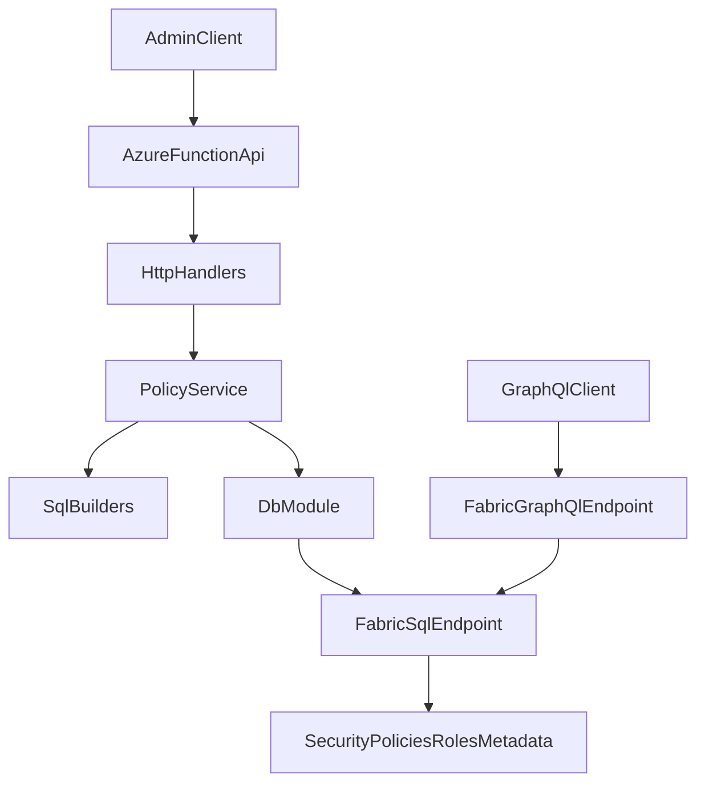

# Fabric Access Control API (Azure Functions + Microsoft Fabric SQL)

This project provides an Azure Function HTTP API that manages customer-specific security in a Fabric SQL Analytics Endpoint.

It configures:
- Row-Level Security (RLS)
- Column-Level Security (CLS)
- Table-Level Security (TLS)

The API is a **control plane**. Your Fabric SQL/GraphQL query path is the **data plane** where policies are enforced at runtime.

## Architecture Design



## End-to-End Flow

1. Admin/system calls API (`POST/PUT/DELETE`) to create or update policy.
2. API validates payload and SQL identifiers.
3. API verifies target table/columns from `INFORMATION_SCHEMA`.
4. API generates SQL statements for RLS/CLS/TLS + metadata updates.
5. SQL executes in one transaction (commit/rollback).
6. Fabric query runtime enforces security automatically using SQL policies.

For GraphQL usage:
- GraphQL auth uses your app registration for access to Fabric endpoint.
- Customer isolation uses delegated Entra user identity mapping (`oid` primary, `upn` secondary).

## API Endpoints

- `POST /api/policies`
  - Creates policy for a customer/table.
- `PUT /api/policies/{customerId}`
  - Updates existing policy (idempotent upsert behavior).
- `DELETE /api/policies/{customerId}`
  - Deletes policy metadata/mappings and drops customer role.
- `GET /api/policies/{customerId}`
  - Returns policy + identity mapping details.
- `POST /api/policies/{customerId}/dry-run`
  - Returns generated SQL without executing.
- `GET /api/introspect/metadata`
  - Lists schemas, tables, columns, and data types for admin UI pickers.
- `GET /api/introspect/sample?schemaName=&tableName=&top=20`
  - Returns top N sample rows for selected table.
- `GET /api/introspect/policy-overlay/{customerId}`
  - Returns currently saved policy + identity map for that customer.
- `GET /api/introspect/filter-fields?schemaName=&tableName=`
  - Returns columns and data types for row-filter builder.

## Request Payload

```json
{
  "customerId": "A",
  "schemaName": "sales",
  "tableName": "Orders",
  "allowedColumns": ["OrderID", "CustomerID", "Amount", "Region"],
  "rowFilter": {
    "column": "CustomerID",
    "operator": "=",
    "value": "A"
  },
  "tableAccess": true,
  "identities": [
    {
      "oid": "00000000-0000-0000-0000-000000000001",
      "upn": "customer.a@contoso.com"
    }
  ]
}
```

## Project Structure and File-by-File Explanation

### Runtime and App Files

- `function_app.py`
  - Azure Functions entrypoint.
  - Registers all HTTP routes and forwards to handlers.
- `host.json`
  - Azure Functions host-level runtime configuration.
  - Includes runtime version and logging/application insights settings.
- `local.settings.json`
  - Local-only app settings and environment variables.
  - Contains `SQL_CONNECTION_STRING`, worker runtime, storage setting.
- `requirements.txt`
  - Python dependencies (`azure-functions`, `pyodbc`).

### Core Source Files (`src/`)

- `src/config.py`
  - Reads and validates env/config values.
  - Ensures SQL connection string exists.
- `src/models.py`
  - Defines request model dataclasses:
    - `PolicyRequest`
    - `RowFilter`
    - `IdentityMapping`
  - Parses and validates incoming JSON payloads.
- `src/db.py`
  - SQL connection and transaction wrapper.
  - Batch execution helper.
  - Query helper for row results.
- `src/sql_builders.py`
  - Validates SQL identifiers (schema/table/column/role/policy names).
  - Builds SQL for:
    - Bootstrap metadata + RLS function
    - Create/update policy actions
    - Delete policy actions
    - Get policy actions
    - Metadata introspection and sample row queries
  - Keeps value inputs parameterized.
- `src/http_handlers.py`
  - HTTP layer for parsing requests and constructing responses.
  - Handles:
    - success response envelopes
    - validation failures (`400`)
    - internal errors (`500`)
  - Adds correlation IDs and logging.

### Services Folder Explanation (`src/services/`)

- `src/services/policy_service.py`
  - Business orchestration layer.
  - Calls DB helpers and SQL builders in proper order.
  - Main responsibilities:
    - Validate table existence and required `CustomerID` column.
    - Execute upsert SQL batch.
    - Execute delete batch.
    - Read policy + identity mapping records.
  - Supports dry-run mode that returns generated SQL.
- `src/services/introspection_service.py`
  - Read-only metadata and discovery layer for admins.
  - Main responsibilities:
    - List schemas/tables/columns from `INFORMATION_SCHEMA`.
    - Return sample rows (`TOP N`) for selected tables.
    - Return policy overlay by customer.
    - Return filter-builder fields (column + datatype).

### SQL Folder Explanation (`sql/`)

- `sql/bootstrap_security.sql`
  - One-time setup script.
  - Creates:
    - `security` schema
    - `security.CustomerIdentityMap`
    - `security.CustomerPolicies`
    - `security.fn_rls_customer_filter`
  - This function checks `SESSION_CONTEXT('customer_oid')` and fallback `SESSION_CONTEXT('customer_upn')`.

- `sql/examples.sql`
  - Demonstration SQL for testing/manual verification.
  - Contains:
    - sample table setup
    - sample security policy creation
    - role grant/deny examples for TLS/CLS
    - sample customer identity mapping and metadata merge

## Security Model (RLS/CLS/TLS)

- **RLS**: security policy + filter predicate restricts rows per mapped customer.
- **CLS**: deny select on columns not listed in `allowedColumns`.
- **TLS**: grant/revoke table-level `SELECT` for customer role.
- **Identity Mapping**:
  - `oid` is primary stable identifier.
  - `upn/email` is secondary for diagnostics.

## `host.json` Explained

Current `host.json` controls:
- Functions host version (`2.0` format for runtime metadata)
- logging defaults
- extension bundle version for bindings/runtime extensions

Usually you modify this for:
- logging verbosity
- sampling settings
- extension bundle compatibility

## `local.settings.json` Explained

Used only for local development (do not commit secrets in real projects).

Important values:
- `AzureWebJobsStorage`
  - Required by Functions runtime locally.
- `FUNCTIONS_WORKER_RUNTIME=python`
  - Tells runtime to load Python worker.
- `SQL_CONNECTION_STRING`
  - Connection string to Fabric SQL endpoint.
- `API_AUTH_LEVEL`
  - Config placeholder for auth level policy.

## How To Run Locally

### Prerequisites

- Python 3.10+ (or compatible with your Functions worker)
- [Azure Functions Core Tools v4](https://learn.microsoft.com/azure/azure-functions/functions-run-local)
- ODBC Driver 18 for SQL Server

### Steps

```bash
cd /Users/blackpearl/Desktop/projects/python/fabric
python3 -m venv .venv
source .venv/bin/activate
pip install -r requirements.txt
func start
```

API base URL locally:
- `http://localhost:7071/api`

## Frontend Admin UI (React + Vite)

The repo now includes a simple admin UI at `frontend/` for policy management.

### Frontend structure

- `frontend/src/App.tsx`
  - Main admin page and state orchestration.
- `frontend/src/api/client.ts`
  - Typed wrappers for policy and introspection endpoints.
- `frontend/src/components/SchemaTablePicker.tsx`
  - Schema/table selectors.
- `frontend/src/components/ColumnChecklist.tsx`
  - Check/uncheck columns for CLS.
- `frontend/src/components/FilterBuilder.tsx`
  - Row filter builder (column/operator/value).
- `frontend/src/components/SampleTablePreview.tsx`
  - Sample rows table preview.
- `frontend/src/components/PolicyOverlay.tsx`
  - Displays current saved policy/identities for customer.
- `frontend/src/components/PolicyActions.tsx`
  - Create/Update/Delete/Dry-run action buttons.

### Frontend env setup

Copy:

```bash
cp frontend/.env.example frontend/.env
```

Default value:
- `VITE_API_BASE_URL=http://localhost:7071/api`

### Run frontend locally

```bash
npm --prefix "/Users/blackpearl/Desktop/projects/python/fabric/frontend" install
npm --prefix "/Users/blackpearl/Desktop/projects/python/fabric/frontend" run dev
```

Frontend URL:
- `http://localhost:5173`

### Run backend + frontend together

Terminal 1 (backend):

```bash
cd /Users/blackpearl/Desktop/projects/python/fabric
source .venv/bin/activate
func start
```

Terminal 2 (frontend):

```bash
npm --prefix "/Users/blackpearl/Desktop/projects/python/fabric/frontend" run dev
```

### Local Test Sequence

1. Run `sql/bootstrap_security.sql` on your Fabric SQL endpoint.
2. Start function app locally.
3. Call `POST /api/policies` with a sample payload.
4. Call `GET /api/policies/{customerId}` to verify metadata.
5. Call `POST /api/policies/{customerId}/dry-run` to inspect generated SQL.
6. Call `DELETE /api/policies/{customerId}` to validate cleanup.

## Example cURL Calls

### Create

```bash
curl -X POST "http://localhost:7071/api/policies" \
  -H "Content-Type: application/json" \
  -d '{
    "customerId":"A",
    "schemaName":"sales",
    "tableName":"Orders",
    "allowedColumns":["OrderID","CustomerID","Amount","Region"],
    "rowFilter":{"column":"CustomerID","operator":"=","value":"A"},
    "tableAccess":true,
    "identities":[{"oid":"00000000-0000-0000-0000-000000000001","upn":"customer.a@contoso.com"}]
  }'
```

### Update

```bash
curl -X PUT "http://localhost:7071/api/policies/A" \
  -H "Content-Type: application/json" \
  -d '{
    "schemaName":"sales",
    "tableName":"Orders",
    "allowedColumns":["OrderID","CustomerID","Amount"],
    "rowFilter":{"column":"CustomerID","operator":"=","value":"A"},
    "tableAccess":true,
    "identities":[{"oid":"00000000-0000-0000-0000-000000000001","upn":"customer.a@contoso.com"}]
  }'
```

### Delete

```bash
curl -X DELETE "http://localhost:7071/api/policies/A"
```

### Dry Run

```bash
curl -X POST "http://localhost:7071/api/policies/A/dry-run" \
  -H "Content-Type: application/json" \
  -d '{
    "schemaName":"sales",
    "tableName":"Orders",
    "allowedColumns":["OrderID","CustomerID","Amount"],
    "rowFilter":{"column":"CustomerID","operator":"=","value":"A"},
    "tableAccess":true,
    "identities":[{"oid":"00000000-0000-0000-0000-000000000001","upn":"customer.a@contoso.com"}]
  }'
```

### Introspection metadata

```bash
curl "http://localhost:7071/api/introspect/metadata"
```

### Introspection sample rows

```bash
curl "http://localhost:7071/api/introspect/sample?schemaName=sales&tableName=Orders&top=20"
```

### Introspection policy overlay

```bash
curl "http://localhost:7071/api/introspect/policy-overlay/A"
```

### Introspection filter fields

```bash
curl "http://localhost:7071/api/introspect/filter-fields?schemaName=sales&tableName=Orders"
```

## Error Handling and Reliability

- Common HTTP statuses:
  - `400`: payload/validation issue
  - `500`: execution/runtime error
- Every response includes:
  - `success`
  - `message`
  - `details`
  - `correlationId`
- SQL execution uses transaction boundaries to prevent partial updates.

## Best Practices Implemented

- Parameterized SQL for value inputs.
- Strict identifier validation for dynamic object names.
- Modular structure for maintainability and testing.
- Clear control plane/data plane separation for GraphQL + Fabric SQL security.
